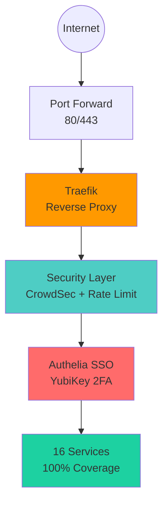

# Production-Grade Homelab Infrastructure

[](https://opensource.org/licenses/MIT)
[](./docs/)
[](./docs/00-foundation/decisions/)

> Enterprise-level self-hosted infrastructure demonstrating DevOps/SRE best practices through practical implementation.

## 🎯 Project Overview

This homelab project showcases production-ready infrastructure skills including container orchestration, phishing-resistant authentication, comprehensive monitoring, and AI-driven intelligence—all documented using Architecture Decision Record (ADR) methodology.

**Health Score: 95/100** | **Services: 16** | **Coverage: 100%**

### Key Achievements

- ✅ **100% Reliability Coverage** - All services have health checks and resource limits
- ✅ **Phishing-Resistant Auth** - YubiKey/WebAuthn (FIDO2) hardware 2FA via Authelia SSO
- ✅ **AI-Driven Intelligence** - Proactive monitoring detecting 8% memory optimization
- ✅ **Enterprise Observability** - Prometheus, Grafana, Loki with 15-second scraping

## 🏗️ Architecture

### High-Level Overview



### Security Layers (Fail-Fast Design)

```
Internet → [1] CrowdSec IP Reputation (cache - fastest)
          ↓
          [2] Rate Limiting (memory check)
          ↓
          [3] Authelia SSO (YubiKey + password - most expensive)
          ↓
          [4] Security Headers (response)
          ↓
          Backend Service ✅
```

**Why this order?** Each layer is computationally more expensive than the previous. Reject malicious traffic early to save resources.

## 🛠️ Technology Stack

### Core Infrastructure

- **Container Runtime:** Podman 5.x (rootless, daemonless)
- **Orchestration:** systemd quadlets (native Linux integration)
- **Reverse Proxy:** Traefik v3.3 (dynamic routing, Let's Encrypt)
- **Security:** CrowdSec (IP reputation), Authelia (SSO + YubiKey 2FA)

### Monitoring & Observability

- **Metrics:** Prometheus (15-second scraping, 15-day retention)
- **Visualization:** Grafana (dashboards, alerting)
- **Logs:** Loki (centralized aggregation, 7-day retention)
- **Alerts:** Alertmanager (Discord webhook notifications)
- **Intelligence:** Custom trend analysis (AI-driven optimization detection)

### Services

- **Media:** Jellyfin (streaming)
- **Photos:** Immich (management + ML processing)
- **Dashboard:** Homepage (service overview)
- **Plus:** 10 monitoring/infrastructure services

## 📚 Documentation Structure

```
docs/
├── 00-foundation/          # Core concepts, ADRs
│   ├── guides/            # Podman, networking, middleware
│   └── decisions/         # Architecture Decision Records (5 ADRs)
├── 10-services/           # Service-specific guides
│   ├── guides/            # Operational documentation
│   └── journal/           # Deployment logs
├── 20-operations/         # Operational procedures
├── 30-security/           # Security hardening
│   ├── guides/            # Authentication, secrets
│   └── decisions/         # Security architecture
├── 40-monitoring/         # Observability stack
├── 90-archive/            # Historical documentation
└── 99-reports/            # System state snapshots
```

**90+ markdown files** following ADR methodology with comprehensive troubleshooting documentation.

## 🔑 Key Features

### 1. Production-Ready Reliability

- **100% health check coverage** (16/16 services)
- **100% resource limit coverage** (OOM protection)
- **Auto-recovery** (`Restart=on-failure` on all services)
- **Health-aware deployments** (validate before success declaration)

### 2. Phishing-Resistant Authentication

- **YubiKey/WebAuthn** as primary 2FA (FIDO2 hardware keys)
- **Single sign-on** across 5+ admin services
- **TOTP fallback** for mobile devices
- **Redis-backed sessions** (1h expiration, 15m inactivity)
- **Granular access control** (per-service policies)

### 3. Enterprise Observability

**Three Pillars Implemented:**
- **Metrics** (Prometheus) - What is happening?
- **Logs** (Loki) - Why is it happening?
- **Alerts** (Alertmanager) - When should I be notified?

**AI Intelligence System:**
- Trend analysis detecting optimizations (-8% memory improvement)
- Statistical modeling (slope, mean, standard deviation)
- Proactive vs reactive monitoring

### 4. Configuration-as-Code

- **Infrastructure-as-Code** (quadlets, Traefik YAML)
- **Git version control** (400+ commits)
- **Secrets management** (Podman secrets, no hardcoded credentials)
- **Template-based deployments** (reusable patterns)

### 5. Security-First Architecture

- **Rootless containers** (UID 1000, no root access)
- **SELinux enforcing** (mandatory access control)
- **Network segmentation** (5 logical networks, trust boundaries)
- **Defense in depth** (layered security, fail-fast)
- **TLS everywhere** (Let's Encrypt auto-renewal)

## 📖 Architecture Decision Records

This project uses ADR methodology to document significant architectural decisions:

1. **[ADR-001: Rootless Containers](docs/00-foundation/decisions/2025-10-20-decision-001-rootless-containers.md)** - Security through least privilege
2. **[ADR-002: systemd Quadlets](docs/00-foundation/decisions/2025-10-25-decision-002-systemd-quadlets-over-compose.md)** - Native orchestration over docker-compose
3. **[ADR-003: Monitoring Stack](docs/40-monitoring-and-documentation/decisions/2025-11-06-decision-001-monitoring-stack-architecture.md)** - Prometheus + Grafana + Loki
4. **[ADR-005: Authelia SSO](docs/30-security/decisions/2025-11-11-decision-005-authelia-sso-yubikey-deployment.md)** - YubiKey-first authentication

Each ADR documents: Context, Decision, Consequences, Alternatives Considered.

## 🎓 Learning Journey

### Problem-Solving Examples

**1. Rate Limiting for Modern SPAs**
- **Problem:** SSO portal error "There was an issue retrieving user state"
- **Root Cause:** 10 req/min too restrictive for modern web apps (15-20 assets on load)
- **Solution:** Increased to 100 req/min for asset-heavy applications
- **Lesson:** Standard API rate limits don't account for SPA architecture

**2. Dual Authentication Anti-Pattern**
- **Problem:** Immich infinite spinning logo, mobile app broken
- **Root Cause:** Layering SSO on top of native service auth creates confusing UX
- **Solution:** Removed Authelia from Immich, use native authentication only
- **Lesson:** Not all services need SSO—consider user experience implications

**3. Database Encryption Key Mismatch**
- **Problem:** Authelia won't start after changing secrets from env vars to file mounts
- **Root Cause:** Database created with different encryption key format
- **Solution:** Backup, delete database, allow recreation with correct key
- **Lesson:** Secret delivery method changes may require data migration

*See [1,000+ line deployment journal](docs/30-security/journal/2025-11-11-authelia-deployment.md) for complete troubleshooting.*

## 📊 Metrics & Results

### System Performance

- **Memory Usage:** 13.5GB / 32GB (42% utilization)
- **Memory Optimization:** -1,152MB (-8%) detected by intelligence system
- **CPU Utilization:** <5% average (idle), spikes to 50-80% during ML processing
- **Uptime:** 99%+ (production services)

### Authentication Metrics

- **Authentication Latency:** <200ms (p95)
- **Session Validation:** <10ms (Redis lookup)
- **Phishing Attempts Possible:** 0 (hardware-bound credentials)

### Monitoring Coverage

- **Prometheus Targets:** 7 (node, containers, Traefik, Authelia)
- **Scrape Interval:** 15 seconds
- **Metric Retention:** 15 days
- **Log Retention:** 7 days
- **Alert Rules:** 5 (CPU, memory, disk, service health, backups)

## 🔧 Skills Demonstrated

### Infrastructure & Operations

✅ Container orchestration (Podman, systemd)
✅ Service reliability (health checks, auto-recovery)
✅ Configuration management (IaC, Git)
✅ Monitoring & observability (metrics, logs, alerts)

### Security

✅ Authentication & authorization (SSO, hardware 2FA)
✅ Defense in depth (layered security)
✅ Secrets management (Podman secrets)
✅ Network segmentation (trust boundaries)

### Software Engineering

✅ Documentation (ADR methodology, 90+ files)
✅ Problem solving (systematic troubleshooting)
✅ Scripting & automation (bash, health-aware deployments)
✅ Version control (Git, 400+ commits)

### DevOps & SRE

✅ CI/CD concepts (automated deployments)
✅ Observability (three pillars: metrics, logs, alerts)
✅ Incident response (deployment journals, troubleshooting)
✅ Capacity planning (proactive monitoring, trend analysis)

## 🚀 Getting Started

### Prerequisites

- Fedora Workstation 42 (or compatible Linux distribution)
- Podman installed (`sudo dnf install podman`)
- 16GB+ RAM (32GB recommended)
- Basic understanding of containers and systemd

### Quick Start

1. **Clone repository:**
   ```bash
   git clone https://github.com/YOUR_USERNAME/homelab-infrastructure-public.git
   cd homelab-infrastructure-public
   ```

2. **Review documentation:**
   ```bash
   # Start with project overview
   cat docs/README.md

   # Review architecture decisions
   ls docs/*/decisions/

   # Check service guides
   ls docs/10-services/guides/
   ```

3. **Adapt to your environment:**
   - Replace `example.com` with your domain
   - Update IP addresses for your network
   - Customize service selection

### Deployment Pattern

This project uses systemd quadlets (not docker-compose):

```bash
# 1. Create quadlet file
nano ~/.config/containers/systemd/service.container

# 2. Reload systemd
systemctl --user daemon-reload

# 3. Start service
systemctl --user start service.service

# 4. Check health
podman healthcheck run service
```

See [CLAUDE.md](CLAUDE.md) for common commands and operations.

## 📂 Repository Structure

```
.
├── docs/                   # 90+ documentation files
│   ├── 00-foundation/     # Core concepts, ADRs
│   ├── 10-services/       # Service guides
│   ├── 20-operations/     # Operational procedures
│   ├── 30-security/       # Security architecture
│   └── 99-reports/        # System state snapshots
├── scripts/               # Automation and diagnostic tools
│   ├── intelligence/      # AI trend analysis
│   ├── security/          # Security audit tools
│   └── *.sh              # Deployment, backup, diagnostic scripts
├── CLAUDE.md             # AI assistant context (common commands)
├── PORTFOLIO.md          # Portfolio showcase document
└── ARCHITECTURE-DIAGRAMS.md  # 10 Mermaid diagrams
```

## 🏆 Portfolio Highlights

**For DevOps/SRE/Platform Engineer Roles:**

- Achieved 100% service reliability coverage demonstrating production-ready practices
- Implemented phishing-resistant authentication (YubiKey/WebAuthn) protecting 5+ admin services
- Built comprehensive observability platform (Prometheus/Grafana/Loki) with proactive AI-driven monitoring
- Documented architectural decisions using ADR methodology (5 major decisions, rationale preserved)
- Created 90+ technical documentation files including 1,000+ line troubleshooting journals

See [RESUME-BULLET-POINTS.md](docs/RESUME-BULLET-POINTS.md) for job-ready resume bullets.

## 📈 Transferable Skills to Enterprise

### Cloud-Native Patterns

This homelab demonstrates patterns transferable to Kubernetes:

| Homelab | Enterprise Kubernetes |
|---------|----------------------|
| systemd quadlets | Kubernetes manifests |
| Health checks | Liveness/readiness probes |
| Resource limits | Resource quotas, QoS tiers |
| Network segmentation | Network policies |
| Podman secrets | Kubernetes secrets/Vault |
| Rootless containers | Pod security policies |

### SRE Practices

- **Service Level Objectives:** 100% health check coverage
- **Error budgets:** Automated recovery strategies
- **Observability:** Three pillars (metrics, logs, alerts)
- **Incident response:** Documented troubleshooting (runbooks)
- **Capacity planning:** Proactive monitoring, trend analysis

## 🤝 Contributing

This is a personal learning project and portfolio piece. If you find it useful:

- ⭐ Star the repository
- 🐛 Open issues for questions or discussions
- 📖 Use documentation as learning resource
- 🔀 Fork and adapt to your environment

**Not accepting PRs** (this is a showcase of personal work), but feedback and discussions are welcome!

## 📄 License

This project is licensed under the MIT License - see the [LICENSE](LICENSE) file for details.

## 🔗 Links

- **Portfolio Document:** [PORTFOLIO.md](docs/PORTFOLIO.md)
- **Architecture Diagrams:** [ARCHITECTURE-DIAGRAMS.md](docs/ARCHITECTURE-DIAGRAMS.md)
- **Resume Bullets:** [RESUME-BULLET-POINTS.md](docs/RESUME-BULLET-POINTS.md)
- **Documentation Index:** [docs/README.md](docs/README.md)

## 💬 Contact

**For hiring inquiries or questions about this project:**
- GitHub: [@YOUR_USERNAME](https://github.com/YOUR_USERNAME)
- LinkedIn: [Your Name](https://linkedin.com/in/yourprofile)
- Email: admin@example.com

---

**⭐ If this project helped you learn something new, consider giving it a star!**

---

*This homelab demonstrates production-ready infrastructure implementation suitable for DevOps, SRE, or Platform Engineering roles. Built with enterprise best practices, documented using ADR methodology, and showcasing real-world problem-solving.*
