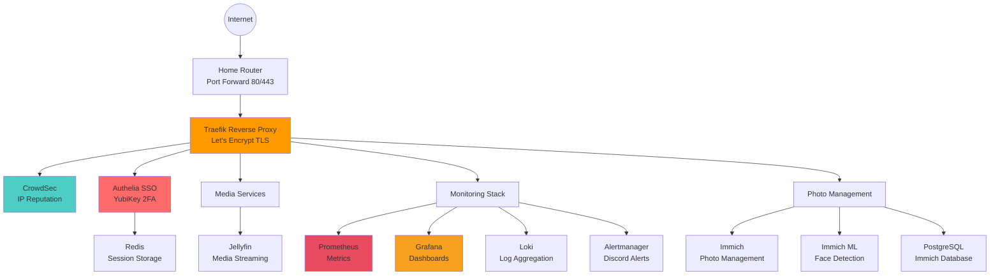
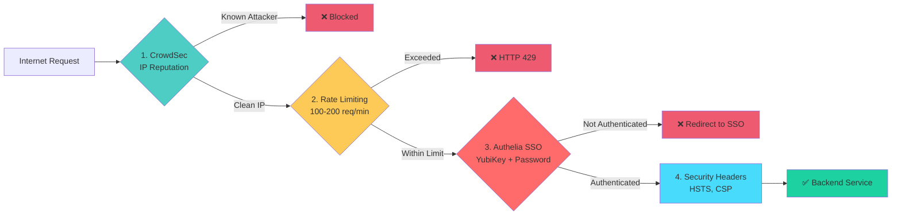
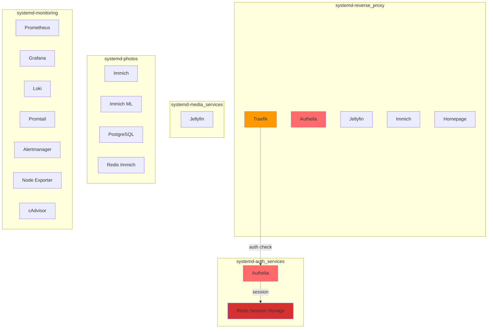
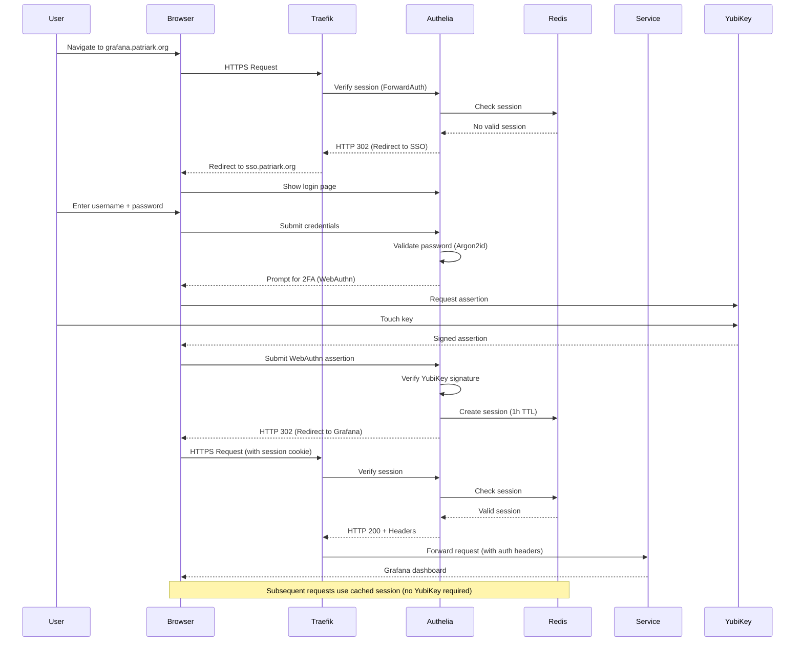
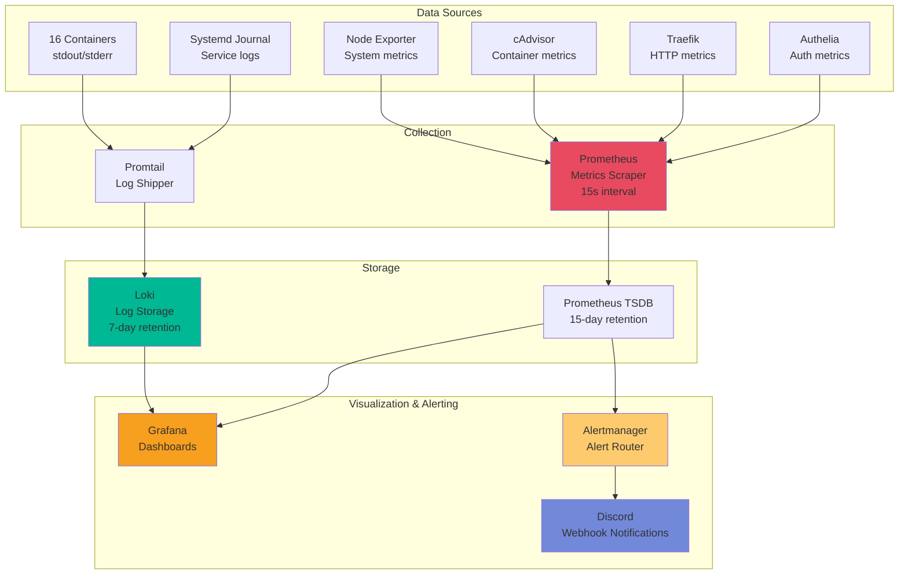
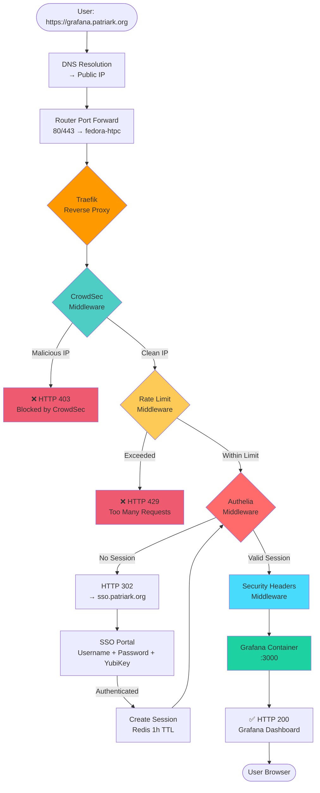
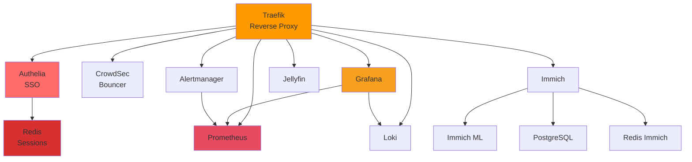
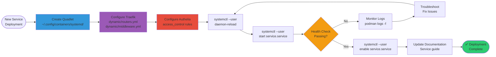
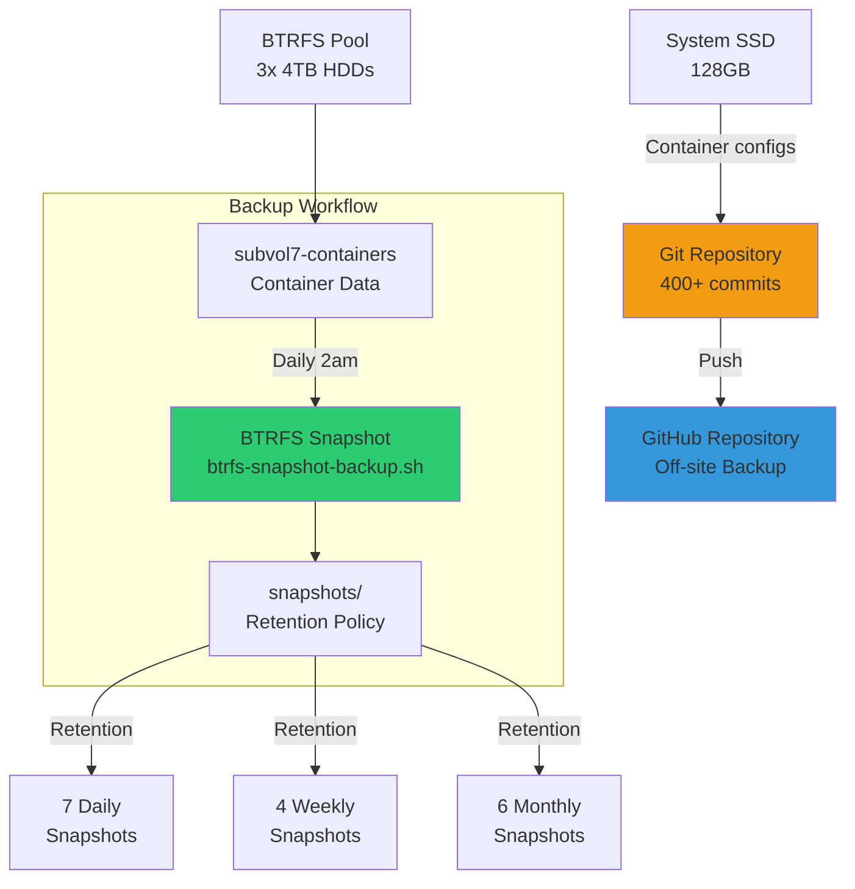
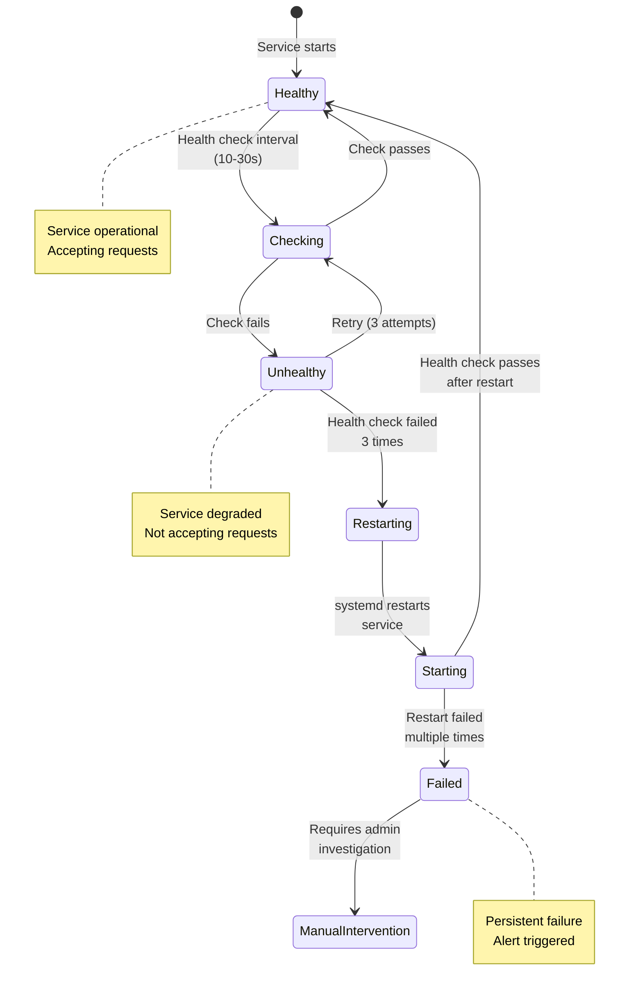

# Architecture Diagrams - Homelab Infrastructure

**Note:** These diagrams use Mermaid syntax and render automatically in GitHub, GitLab, and many markdown viewers.

---

## 1. High-Level System Architecture



---

## 2. Security Layers (Fail-Fast Architecture)



**Why this order?**
- Each layer is computationally more expensive than the previous
- Reject bad traffic early (fail-fast) to save resources
- CrowdSec: Cache lookup (~1ms)
- Rate limiting: Memory check (~5ms)
- Authelia: Database + session + WebAuthn (~50-200ms)

---

## 3. Network Segmentation



**Key Principles:**
- Services join networks based on trust level and communication needs
- First network in quadlet determines default route
- Internal-only services on single network
- External services span multiple networks

---

## 4. Authentication Flow



---

## 5. Monitoring & Observability Architecture



**Three Pillars of Observability:**
1. **Metrics** (Prometheus) - What is happening? (counters, gauges, histograms)
2. **Logs** (Loki) - Why is it happening? (event details)
3. **Alerts** (Alertmanager) - When should I be notified?

---

## 6. Data Flow - User Request Journey



---

## 7. Service Dependencies



**Critical Dependencies:**
- **Traefik** depends on nothing (entry point)
- **Authelia** depends on Redis (sessions)
- **Grafana** depends on Prometheus + Loki (data sources)
- **Immich** depends on PostgreSQL + Redis + Immich ML

---

## 8. Deployment Workflow



---

## 9. Backup Strategy



**Backup Coverage:**
- **Configurations:** Git repository (version-controlled)
- **Container data:** BTRFS snapshots (point-in-time recovery)
- **Secrets:** Podman secrets (tmpfs, not persisted - manual backup required)

---

## 10. Health Check & Auto-Recovery



**Auto-Recovery Configuration:**
```ini
[Container]
HealthCmd=wget --spider http://localhost:9091/api/health
HealthInterval=30s
HealthTimeout=10s
HealthRetries=3
HealthStartPeriod=60s

[Service]
Restart=on-failure
RestartSec=30s
```

---

## Diagram Usage

### For Portfolio/Resume

1. **High-Level Architecture** - Shows overall system design
2. **Security Layers** - Demonstrates defense-in-depth
3. **Monitoring Architecture** - Shows observability practices

### For Documentation

4. **Network Segmentation** - Reference for service deployment
5. **Authentication Flow** - Troubleshooting SSO issues
6. **Data Flow** - Understanding request journey

### For Presentations

7. **Service Dependencies** - Understanding critical paths
8. **Deployment Workflow** - Onboarding new team members
9. **Backup Strategy** - Disaster recovery planning

---

## How to View These Diagrams

**GitHub/GitLab:** Renders automatically in markdown files

**VS Code:** Install "Markdown Preview Mermaid Support" extension

**Online:** Copy to https://mermaid.live for editing

**Export:** Use mermaid-cli to generate PNG/SVG:
```bash
npm install -g @mermaid-js/mermaid-cli
mmdc -i ARCHITECTURE-DIAGRAMS.md -o diagrams.pdf
```

---

**Pro Tip:** These diagrams can be embedded in your portfolio website, presentations, or printed documentation. They're version-controlled in Git and update as the architecture evolves.
