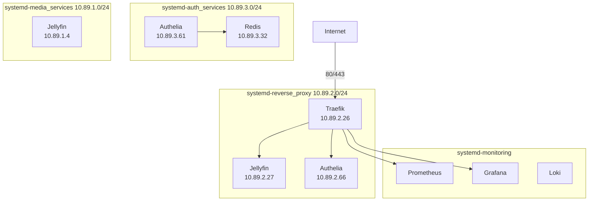
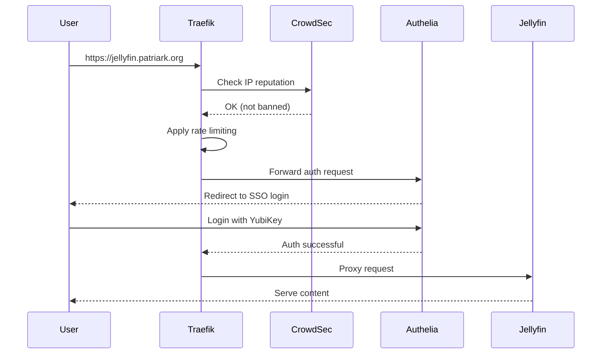
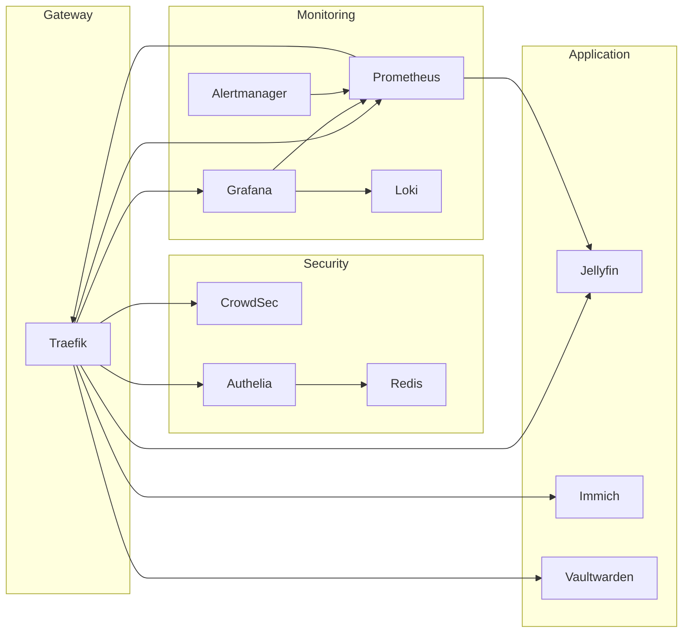

# Project C: Automated Architecture Documentation

**Status:** High-Level Plan (Ready for Detailed Planning)
**Priority:** 📚 MEDIUM-HIGH
**Value Proposition:** Reduce context-gathering toil, maintain living documentation
**Estimated Effort:** 4-6 hours (detailed planning: +2 hours)
**Dependencies:** None (standalone project)

---

## Executive Summary

Your homelab has **excellent manual documentation** (160 markdown files, 13 ADRs, 35+ reports) but it's scattered, manually maintained, and lacks visual representations of architecture.

**The Problem:**
- Onboarding yourself after vacation = 30 minutes re-reading docs
- No single source of truth for "what's running?"
- No visual network topology or service dependency maps
- Documentation maintenance is manual toil
- Architecture changes require manual doc updates

**The Solution:**
Auto-generate living documentation by parsing:
- Quadlet files → Service inventory
- Network configs → Topology diagrams
- Traefik labels → Service routing maps
- Git history → Change logs
- Reports → Timeline visualization

**The Result:**
```
Before: "What services exist?" → Grep through quadlets for 10 minutes
After:  "What services exist?" → Open auto-generated service catalog (2 seconds)
```

---

## Problem Statement

### Documentation Pain Points

**Discovery Issues:**
- "Which services are deployed?" → Check podman ps + quadlet directory + docs
- "How are networks connected?" → Mental model + trial-and-error
- "What depends on what?" → Grep through configs, hope you find everything
- "When was X deployed?" → Search git log + reports

**Maintenance Burden:**
- Add new service → Must update multiple docs manually
- Network topology changes → Update network diagrams by hand
- ADR compliance → Manual review of each service
- Onboarding after time away → Re-learn everything

**Missing Visualizations:**
- No network topology diagram
- No service dependency graph
- No routing flow visualization (Traefik → Services)
- No timeline of architectural changes

### Current Documentation State

**What Exists (160 files):**
- ✅ Comprehensive guides (backup, deployment, troubleshooting)
- ✅ ADRs documenting decisions
- ✅ Session reports with detailed notes
- ✅ Runbooks for operations

**What's Missing:**
- ❌ Auto-generated service catalog
- ❌ Network topology diagrams
- ❌ Dependency graphs
- ❌ Unified documentation index
- ❌ Change detection (auto-update docs when configs change)

---

## Proposed Architecture

### Auto-Documentation System

```
┌────────────────────────────────────────────────────────────┐
│              Data Sources (Read-Only)                      │
│  - Quadlets (.container files)                            │
│  - Podman inspect (running state)                         │
│  - Network configs (.network files)                       │
│  - Traefik configs (routers, middleware)                  │
│  - Git log (deployment history)                           │
│  - Reports (99-reports/*.md)                              │
└────────────────────────────────────────────────────────────┘
                             │
                             ▼
┌────────────────────────────────────────────────────────────┐
│                     Parsers & Analyzers                    │
│  - Quadlet parser      → Service definitions              │
│  - Network parser      → Network topology                 │
│  - Traefik parser      → Routing maps                     │
│  - Git log analyzer    → Deployment timeline              │
│  - Dependency resolver → Service relationships            │
└────────────────────────────────────────────────────────────┘
                             │
                             ▼
┌────────────────────────────────────────────────────────────┐
│                  Generators (Create Docs)                  │
│  1. Service Catalog     → Markdown table                  │
│  2. Network Topology    → Graphviz/Mermaid diagram        │
│  3. Dependency Graph    → Graphviz/Mermaid diagram        │
│  4. Documentation Index → Categorized link list           │
│  5. Architecture Summary→ Human-readable overview         │
└────────────────────────────────────────────────────────────┘
                             │
                             ▼
┌────────────────────────────────────────────────────────────┐
│              Output (Auto-Generated Docs)                  │
│  - docs/AUTO-SERVICE-CATALOG.md                           │
│  - docs/AUTO-NETWORK-TOPOLOGY.md (with diagrams)          │
│  - docs/AUTO-DEPENDENCY-GRAPH.md (with diagrams)          │
│  - docs/AUTO-DOCUMENTATION-INDEX.md                       │
│  - docs/AUTO-ARCHITECTURE-SUMMARY.md                      │
└────────────────────────────────────────────────────────────┘
                             │
                             ▼
┌────────────────────────────────────────────────────────────┐
│           Change Detection & Auto-Update                   │
│  - Git pre-commit hook detects quadlet/config changes     │
│  - Triggers doc regeneration                              │
│  - Commits updated docs automatically                     │
└────────────────────────────────────────────────────────────┘
```

---

## Components Overview

### Component 1: Service Catalog Generator

**Purpose:** Auto-generate comprehensive inventory of all services

**Data Sources:**
- Quadlet files (`~/.config/containers/systemd/*.container`)
- Running containers (`podman ps --format json`)
- Traefik configs (for public URLs)

**Output:** `docs/AUTO-SERVICE-CATALOG.md`

**Content:**
```markdown
# Service Catalog (Auto-Generated)

**Last Updated:** 2025-11-15 14:32:00 UTC
**Total Services:** 20 running, 22 defined

---

## Services by Category

### Reverse Proxy & Gateway (1)

| Service | Image | Networks | Ports | URL | Status | Uptime |
|---------|-------|----------|-------|-----|--------|--------|
| traefik | traefik:v3.2 | reverse_proxy, auth_services, monitoring | 80, 443, 8080 | traefik.patriark.org | ✅ Healthy | 26h |

### Media Services (1)

| Service | Image | Networks | Ports | URL | Status | Uptime |
|---------|-------|----------|-------|-----|--------|--------|
| jellyfin | jellyfin/jellyfin:latest | reverse_proxy, media_services | 8096, 7359 | jellyfin.patriark.org | ✅ Healthy | 3d 21h |

### Authentication (2)

| Service | Image | Networks | Ports | URL | Status | Uptime |
|---------|-------|----------|-------|-----|--------|--------|
| authelia | authelia/authelia:latest | reverse_proxy, auth_services | 9091 | sso.patriark.org | ✅ Healthy | 23h |
| authelia-redis | redis:7-alpine | auth_services | 6379 | - | ✅ Healthy | 25h |

### Monitoring Stack (7)

[...]

---

## Service Details

### traefik

**Image:** docker.io/library/traefik:v3.2
**Quadlet:** ~/.config/containers/systemd/traefik.container
**Networks:** systemd-reverse_proxy, systemd-auth_services, systemd-monitoring
**Volumes:**
  - ~/containers/config/traefik/etc:/etc/traefik:Z (ro)
  - ~/containers/config/traefik/acme:/acme:Z
**Exposed Ports:** 80:80, 443:443, 8080:8080
**Public URLs:**
  - https://traefik.patriark.org (dashboard)
**Health Check:** http://localhost:8080/ping
**Memory Limit:** None configured
**CPU Quota:** None configured
**Restart Policy:** always
**Dependencies:** None (gateway service)
**ADR References:** ADR-006 (Traefik middleware patterns)

[... repeat for all 20 services ...]
```

**Acceptance Criteria:**
- [ ] All running services listed
- [ ] Service details complete (image, networks, ports, URLs)
- [ ] Categorized by function
- [ ] Links to quadlet files, ADRs, guides
- [ ] Updates automatically when services change

---

### Component 2: Network Topology Visualizer

**Purpose:** Generate network diagrams showing service connectivity

**Output:** `docs/AUTO-NETWORK-TOPOLOGY.md` with Mermaid diagrams

**Diagram 1: Network Overview**


**Diagram 2: Request Flow (User → Service)**


**Acceptance Criteria:**
- [ ] All 5 networks visualized
- [ ] Service placement correct
- [ ] IP addresses shown
- [ ] Request flow diagrams for common paths
- [ ] Updates automatically when network configs change

---

### Component 3: Dependency Graph Generator

**Purpose:** Visualize service dependencies (which services depend on what)

**Approach:**
1. Parse quadlet files for `After=`, `Requires=` directives
2. Parse Traefik configs for service routing
3. Infer dependencies from network membership
4. Generate directed graph

**Output:** `docs/AUTO-DEPENDENCY-GRAPH.md`

**Diagram Example:**


**Dependency Table:**

| Service | Depends On | Used By | Critical Path? |
|---------|-----------|---------|---------------|
| Traefik | None (gateway) | All public services | ✅ Critical |
| Authelia | Redis | Traefik (auth middleware) | ✅ Critical |
| Redis | None | Authelia | ⚠️ Important |
| Jellyfin | None | Users (via Traefik) | 🟢 Standalone |
| Prometheus | All services (metrics) | Grafana, Alertmanager | ✅ Critical |

**Acceptance Criteria:**
- [ ] All dependencies identified
- [ ] Critical path highlighted
- [ ] Circular dependencies detected (if any)
- [ ] Startup order recommendations
- [ ] Updates automatically

---

### Component 4: Documentation Index Aggregator

**Purpose:** Single entry point to all documentation

**Output:** `docs/AUTO-DOCUMENTATION-INDEX.md`

**Structure:**
```markdown
# Documentation Index (Auto-Generated)

**Last Updated:** 2025-11-15 14:32:00 UTC
**Total Documents:** 160

---

## Quick Links

- [Service Catalog](AUTO-SERVICE-CATALOG.md) - All running services
- [Network Topology](AUTO-NETWORK-TOPOLOGY.md) - Network diagrams
- [Dependency Graph](AUTO-DEPENDENCY-GRAPH.md) - Service relationships
- [Architecture Summary](AUTO-ARCHITECTURE-SUMMARY.md) - Overview

---

## Documentation by Category

### Foundation (15 documents)
- [Podman Rootless Guide](00-foundation/guides/podman-rootless.md)
- [Systemd Quadlets Guide](00-foundation/guides/systemd-quadlets.md)
- [BTRFS Storage Layout](00-foundation/guides/btrfs-storage.md)
- [ADR-001: Rootless Containers](00-foundation/decisions/2025-10-20-decision-001-rootless-containers.md)
- [ADR-002: Systemd Quadlets](00-foundation/decisions/2025-10-25-decision-002-systemd-quadlets-over-compose.md)
[...]

### Services (42 documents)
- [Traefik Guide](10-services/guides/traefik.md)
- [Jellyfin Guide](10-services/guides/jellyfin.md)
- [Authelia Guide](10-services/guides/authelia.md)
- [CrowdSec Guide](10-services/guides/crowdsec.md)
[...]

### Operations (28 documents)
- [Backup Strategy](20-operations/guides/backup-strategy.md)
- [Disaster Recovery](20-operations/guides/disaster-recovery.md)
- [Deployment Workflow](20-operations/guides/deployment-workflow.md)
[...]

### Security (18 documents)
- [Security Architecture](30-security/guides/security-architecture.md)
- [ADR-005: Authelia SSO](30-security/decisions/2025-11-11-decision-005-authelia-sso-yubikey-deployment.md)
- [ADR-006: CrowdSec Integration](30-security/decisions/2025-11-12-decision-006-crowdsec-integration.md)
[...]

### Monitoring (22 documents)
- [Monitoring Stack Guide](40-monitoring-and-documentation/guides/monitoring-stack.md)
- [Grafana Dashboards](40-monitoring-and-documentation/guides/grafana-dashboards.md)
- [Prometheus Configuration](40-monitoring-and-documentation/guides/prometheus-configuration.md)
[...]

### Reports (35 documents)
- [Latest System State](99-reports/latest-summary.md)
- [2025-11-12 System Intelligence](99-reports/2025-11-12-system-intelligence-report.md)
- [Session 3 Completion](99-reports/2025-11-14-session-3-completion-summary.md)
[...]

---

## Documents by Type

### Guides (Living Documents): 68
[Alphabetical list with links]

### Journal Entries (Dated Logs): 42
[Chronological list with links]

### Architecture Decision Records (ADRs): 13
[Numbered list with status]

### Reports (Point-in-Time): 35
[Chronological list]

### Runbooks (Procedures): 8
[Categorized list]

---

## Recently Updated (Last 7 Days)

1. [Session 4 Hybrid Plan](99-reports/2025-11-15-session-4-hybrid-plan.md) - 2025-11-15
2. [Session 3 Completion](99-reports/2025-11-14-session-3-completion-summary.md) - 2025-11-14
3. [Skill Integration Guide](10-services/guides/skill-integration-guide.md) - 2025-11-14
[...]

---

## Search by Service

- Traefik: [Guide](10-services/guides/traefik.md) | [ADR-006](30-security/decisions/...) | [Reports](...)
- Jellyfin: [Guide](10-services/guides/jellyfin.md) | [Deployment Journal](10-services/journal/...) | [Troubleshooting](...)
[...]
```

**Acceptance Criteria:**
- [ ] All 160 documents indexed
- [ ] Categorized by directory structure
- [ ] Grouped by type (guides, journals, ADRs, reports)
- [ ] Recently updated section (last 7 days)
- [ ] Search by service feature
- [ ] Auto-updates daily

---

### Component 5: Architecture Summary Generator

**Purpose:** Human-readable "state of the homelab" overview

**Output:** `docs/AUTO-ARCHITECTURE-SUMMARY.md`

**Content:**
```markdown
# Architecture Summary (Auto-Generated)

**Generated:** 2025-11-15 14:32:00 UTC
**System:** fedora-htpc
**OS:** Fedora 42 (Kernel 6.17.6)
**Uptime:** 8 days

---

## At a Glance

- **Total Services:** 20 running (22 defined)
- **Networks:** 5 isolated networks
- **Storage:** 128GB system + 13TB BTRFS pool
- **Public Services:** 8 (internet-accessible)
- **Authentication:** Authelia SSO + YubiKey MFA
- **Monitoring:** Prometheus + Grafana + Loki

---

## Architecture Principles (from ADRs)

1. **Rootless Containers** (ADR-001)
   - All containers run as unprivileged user (UID 1000)
   - Enhanced security, SELinux enforcing
   - Status: ✅ 100% compliance (20/20 services rootless)

2. **Systemd Quadlets** (ADR-002)
   - Native systemd integration, no docker-compose
   - Unified logging via journalctl
   - Status: ✅ 100% compliance (all services use quadlets)

3. **Layered Security** (ADR-006)
   - CrowdSec IP reputation → Rate limiting → Authelia SSO → Security headers
   - Zero-trust model for internet-facing services
   - Status: ⚠️ 75% compliance (middleware standardization needed)

4. **Monitoring-First** (ADR-003)
   - Prometheus metrics for all services
   - Grafana dashboards for visualization
   - Loki for log aggregation
   - Status: ✅ 100% coverage (9/9 targets scraped)

---

## Service Distribution

**By Network:**
- systemd-reverse_proxy: 11 services (public gateway)
- systemd-monitoring: 12 services (observability)
- systemd-auth_services: 5 services (authentication)
- systemd-media_services: 2 services (media)
- systemd-photos: 5 services (photo management)

**By Criticality:**
- Critical (Tier 1): Traefik, Authelia, Prometheus, Grafana - 4 services
- Important (Tier 2): Jellyfin, CrowdSec, Loki, Alertmanager - 8 services
- Standard (Tier 3): Immich, Vaultwarden, exporters - 8 services

---

## Key Metrics

**Resource Usage:**
- Memory: 16.4GB / 31GB (52%)
- Disk (System): 90GB / 118GB (78%) ⚠️
- Disk (BTRFS): 8.4TB / 13TB (65%)
- Load Average: 0.62 (normal)

**Availability:**
- Uptime (System): 8 days
- Uptime (Services): 1h - 3d 21h
- Health Checks: 20/20 passing ✅

**Security:**
- CrowdSec Bans: 0 active
- Failed Auth (24h): [from logs]
- SSL Cert Expiry: 62 days

**Backups:**
- Last Backup: 2 days ago
- Backup Size: 2.7TB
- Restore Test: 1 month ago ⚠️

---

## Recent Changes (Git Log)

- 2025-11-15: Session 4 planning (context framework)
- 2025-11-14: Session 3 bug fixes (drift detection)
- 2025-11-14: Session 3 completion (pattern library)
- 2025-11-12: CrowdSec fixes + Grafana dashboards
[...]

---

## Architecture Diagrams

- [Network Topology](AUTO-NETWORK-TOPOLOGY.md)
- [Service Dependencies](AUTO-DEPENDENCY-GRAPH.md)
- [Request Flow Diagrams](AUTO-NETWORK-TOPOLOGY.md#request-flow)

---

## Health Summary

| Category | Status | Details |
|----------|--------|---------|
| Service Availability | ✅ Healthy | 20/20 running |
| Security Posture | 🟡 Good | 75% ADR compliance |
| Monitoring Coverage | ✅ Excellent | 100% coverage |
| Resource Utilization | ⚠️ Warning | System disk 78% |
| Backup Integrity | ⚠️ Warning | Restore test overdue |

---

**Next Steps:**
1. Address system disk usage (78% → target <70%)
2. Run restore test (overdue by 5 days)
3. Complete ADR-006 compliance (middleware standardization)
```

**Acceptance Criteria:**
- [ ] Concise overview (1-2 pages)
- [ ] Key metrics from latest reports
- [ ] Recent changes from git log
- [ ] Health summary table
- [ ] Links to detailed docs
- [ ] Auto-updates daily

---

## Implementation Roadmap

### Phase 1: Parsers & Data Collection (1-2 hours)
- [ ] Create quadlet parser (extract service definitions)
- [ ] Create network parser (extract topology)
- [ ] Create Traefik config parser (extract routing)
- [ ] Create git log analyzer (extract deployment timeline)

### Phase 2: Service Catalog (1 hour)
- [ ] Generate service inventory table
- [ ] Add service details sections
- [ ] Link to quadlets, ADRs, guides
- [ ] Test output format

### Phase 3: Visualizations (1-2 hours)
- [ ] Generate network topology (Mermaid diagrams)
- [ ] Generate dependency graph
- [ ] Generate request flow diagrams
- [ ] Test diagram rendering

### Phase 4: Aggregation (1 hour)
- [ ] Generate documentation index
- [ ] Categorize all 160 files
- [ ] Add search/filter features
- [ ] Link everything together

### Phase 5: Architecture Summary (30 min)
- [ ] Aggregate data from reports
- [ ] Generate health summary
- [ ] Add recent changes section
- [ ] Test readability

### Phase 6: Automation (1 hour)
- [ ] Create main orchestration script
- [ ] Add git pre-commit hook
- [ ] Schedule daily regeneration (cron/systemd)
- [ ] Test auto-update workflow

---

## Deliverables

### Scripts
- `scripts/generate-service-catalog.sh`
- `scripts/generate-network-topology.sh`
- `scripts/generate-dependency-graph.sh`
- `scripts/generate-doc-index.sh`
- `scripts/generate-architecture-summary.sh`
- `scripts/auto-doc-orchestrator.sh` (runs all generators)

### Auto-Generated Documentation
- `docs/AUTO-SERVICE-CATALOG.md`
- `docs/AUTO-NETWORK-TOPOLOGY.md`
- `docs/AUTO-DEPENDENCY-GRAPH.md`
- `docs/AUTO-DOCUMENTATION-INDEX.md`
- `docs/AUTO-ARCHITECTURE-SUMMARY.md`

### Automation
- `.git/hooks/pre-commit` (regenerate on config changes)
- Systemd timer for daily updates

---

## Example Use Cases

### Use Case 1: Quick System Overview
**Before:** Read 5+ docs, grep configs, check podman ps
**After:** Open `AUTO-ARCHITECTURE-SUMMARY.md` (2 seconds)

### Use Case 2: Network Troubleshooting
**Before:** Mental model + trial-and-error
**After:** Open `AUTO-NETWORK-TOPOLOGY.md`, see visual diagram

### Use Case 3: Planning New Service
**Before:** Check which networks exist, guess dependencies
**After:** Check `AUTO-DEPENDENCY-GRAPH.md`, see similar services

### Use Case 4: Onboarding After Vacation
**Before:** 30+ minutes re-reading scattered docs
**After:** Read `AUTO-ARCHITECTURE-SUMMARY.md` (5 minutes)

---

## Success Metrics

### Quantitative
- [ ] Context-gathering time: 30min → 5min (83% reduction)
- [ ] All 20 services documented automatically
- [ ] 160 docs indexed and categorized
- [ ] Diagrams update automatically on config changes

### Qualitative
- [ ] Single source of truth for "what's running?"
- [ ] Visual understanding of architecture
- [ ] Easy onboarding for future you
- [ ] Reduced documentation maintenance burden

---

## Future Enhancements (Beyond Scope)

### Interactive Dashboards
- Web-based service catalog (searchable, filterable)
- Live network topology (updates in real-time)
- Dependency graph explorer (click to see details)

### Advanced Visualizations
- Timeline view of architectural changes
- Heat map of service activity
- Resource usage visualization per service

### AI Integration
- Natural language queries ("Which services depend on Redis?")
- Automated documentation suggestions
- Anomaly detection in architecture

---

## Next Steps

**To proceed with Project C:**

1. **Review this high-level plan** - Confirm scope and priorities
2. **Choose diagram tool** - Mermaid (in markdown) vs Graphviz (PNG)?
3. **Request detailed implementation plan** - If desired
4. **Schedule CLI sessions** - When ready to implement

**Questions to answer before detailed planning:**
- Prefer Mermaid (text-based, GitHub renders) or Graphviz (image files)?
- Should docs regenerate on every git commit or daily only?
- Which auto-generated doc is highest priority?
- Want web-based interface or markdown-only?

---

**Status:** High-level plan complete
**Ready for:** Detailed implementation planning (add 2 hours for full plan)
**Estimated Total:** 4-6 hours implementation + 2 hours planning = 6-8 hours
