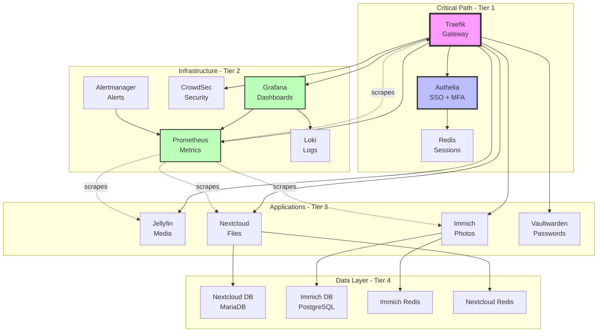

# Service Dependency Graph (Auto-Generated)

**Generated:** 2026-01-31 06:00:36 UTC
**System:** fedora-htpc

This document visualizes service dependencies and critical paths in the homelab infrastructure.

---

## Dependency Overview

Shows how services depend on each other, organized by tier.

---

## Critical Path Analysis

### Tier 1: Critical Services

These services must be running for the homelab to function:

| Service | Role | Dependent Services | Impact if Down |
|---------|------|-------------------|----------------|
| **Traefik** | Gateway | All public services | 🔴 Total outage - no external access |
| **Authelia** | Authentication | Protected services | 🟡 Cannot access protected services |
| **Redis (Authelia)** | Session storage | Authelia | 🟡 All users logged out, must re-auth |

**Critical path:** Internet → Traefik → Authelia → Redis

### Tier 2: Infrastructure Services

Supporting services for operations:

| Service | Role | Dependent Services | Impact if Down |
|---------|------|-------------------|----------------|
| **Prometheus** | Metrics collection | Grafana, Alertmanager | 🟡 No metrics, blind operation |
| **Grafana** | Visualization | Users (dashboards) | 🟢 Dashboards unavailable, metrics still collected |
| **Loki** | Log aggregation | Grafana (logs view) | 🟢 Log queries unavailable |
| **CrowdSec** | Security | Traefik (IP blocking) | 🟡 Reduced security posture |
| **Alertmanager** | Alerting | Prometheus | 🟢 Alerts not sent, monitoring continues |

### Tier 3: Application Services

End-user applications:

| Service | Role | Dependencies | Impact if Down |
|---------|------|--------------|----------------|
| **Jellyfin** | Media streaming | Traefik | 🟢 Media unavailable, other services OK |
| **Immich** | Photo management | Traefik, PostgreSQL, Redis | 🟢 Photos unavailable |
| **Nextcloud** | File sync | Traefik, MariaDB, Redis | 🟢 Files unavailable |
| **Vaultwarden** | Password manager | Traefik | 🟡 Passwords inaccessible (keep local vault) |

### Tier 4: Data Layer

Backend data services:

| Service | Role | Used By | Impact if Down |
|---------|------|---------|----------------|
| **PostgreSQL (Immich)** | Database | Immich | 🔴 Immich completely non-functional |
| **MariaDB (Nextcloud)** | Database | Nextcloud | 🔴 Nextcloud completely non-functional |
| **Redis (Immich)** | Cache/Queue | Immich | 🟡 Immich degraded performance |
| **Redis (Nextcloud)** | Cache | Nextcloud | 🟡 Nextcloud degraded performance |

---

## Startup Order Recommendations

Based on dependencies, services should start in this order:

1. **Data Layer** (databases and caches)
   - redis-authelia
   - postgresql-immich
   - nextcloud-db
   - redis-immich
   - nextcloud-redis

2. **Critical Services**
   - traefik
   - crowdsec
   - authelia

3. **Infrastructure**
   - prometheus
   - loki
   - alertmanager

4. **Visualization**
   - grafana

5. **Applications** (can start in parallel)
   - jellyfin
   - immich-server, immich-ml, immich-microservices
   - nextcloud
   - vaultwarden

6. **Monitoring Exporters**
   - node-exporter
   - cadvisor
   - promtail

**Note:** systemd handles this automatically via `After=` directives in quadlet files.

---

## Network-Based Dependencies

Services on the same network can communicate:

**auth_services:** authelia,redis-authelia,traefik

**gathio:** gathio,gathio-db

**home_automation:** home-assistant,matter-server

**media_services:** jellyfin

**monitoring:** alert-discord-relay,alertmanager,cadvisor,gathio,grafana,home-assistant,immich-server,jellyfin,loki,nextcloud,nextcloud-db,nextcloud-redis,node_exporter,prometheus,promtail,traefik,unpoller

**nextcloud:** collabora,nextcloud,nextcloud-db,nextcloud-redis

**photos:** immich-ml,immich-server,postgresql-immich,redis-immich

**reverse_proxy:** alertmanager,authelia,collabora,crowdsec,gathio,grafana,home-assistant,homepage,immich-server,jellyfin,loki,nextcloud,prometheus,traefik,vaultwarden

---

## Service Overrides

Some services have special handling in autonomous operations:

| Service | Auto-Restart | Rationale |
|---------|--------------|-----------|
| traefik | ❌ No | Gateway service - manual intervention required |
| authelia | ❌ No | Authentication service - manual intervention required |
| Others | ✅ Yes | Can be automatically restarted if unhealthy |

See `~/containers/.claude/context/preferences.yml` for configuration.

---

## Quick Links

- [Service Catalog](AUTO-SERVICE-CATALOG.md) - What's running
- [Network Topology](AUTO-NETWORK-TOPOLOGY.md) - Network architecture
- [Homelab Architecture](20-operations/guides/homelab-architecture.md) - Full documentation
- [Autonomous Operations](20-operations/guides/autonomous-operations.md) - OODA loop

---

*Auto-generated by `scripts/generate-dependency-graph.sh`*
