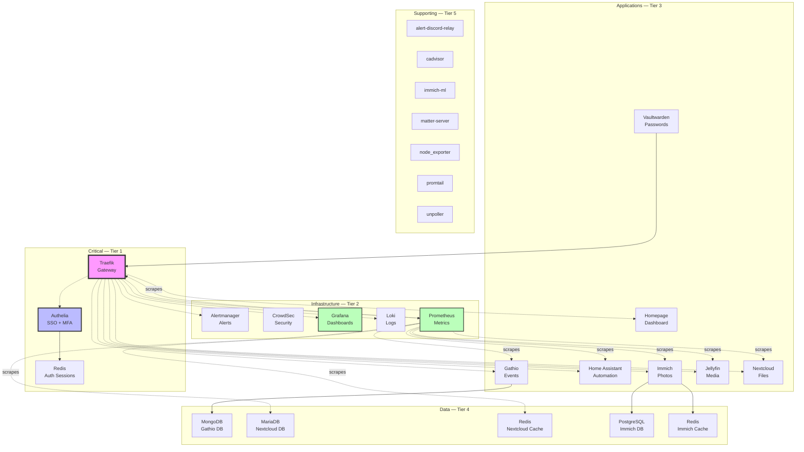

# Service Dependency Graph (Auto-Generated)

**Generated:** 2026-02-14 12:54:02 UTC
**System:** fedora-htpc

---

## Dependency Overview

Shows how services depend on each other, organized by tier. Edges are derived from quadlet `Requires=` and `After=` directives.

---

## Critical Path Analysis

### Tier 1: Critical

| Service | Hard Dependencies | Impact if Down |
|---------|-------------------|----------------|
| **authelia** | redis-authelia | 🟡 Cannot access Authelia-protected services (monitoring, dashboard) |
| **redis-authelia** | — | 🟡 All SSO sessions lost, users must re-authenticate |
| **traefik** | — | 🔴 Total outage — no external access to any service |

### Tier 2: Infrastructure

| Service | Hard Dependencies | Impact if Down |
|---------|-------------------|----------------|
| **alertmanager** | — | 🟢 Alerts not routed, monitoring continues |
| **crowdsec** | — | 🟡 Reduced security — no IP reputation filtering |
| **grafana** | — | 🟢 Dashboards unavailable, metrics still collected |
| **loki** | — | 🟢 Log queries unavailable, logs still forwarded |
| **prometheus** | — | 🟡 No metrics collection, blind operation |

### Tier 3: Applications

| Service | Hard Dependencies | Impact if Down |
|---------|-------------------|----------------|
| **gathio** | gathio-db | 🟢 Event management unavailable |
| **home-assistant** | — | 🟡 Automations stop, smart home degraded |
| **homepage** | — | 🟢 Dashboard unavailable |
| **immich-server** | postgresql-immich,redis-immich | 🟢 Photo management unavailable |
| **jellyfin** | — | 🟢 Media streaming unavailable |
| **nextcloud** | — | 🟢 File sync unavailable |
| **vaultwarden** | traefik | 🟡 Password vault inaccessible (keep local cache) |

### Tier 4: Data

| Service | Hard Dependencies | Impact if Down |
|---------|-------------------|----------------|
| **gathio-db** | — | 🔴 Gathio completely non-functional |
| **nextcloud-db** | — | 🔴 Nextcloud completely non-functional |
| **nextcloud-redis** | — | 🟡 Nextcloud degraded performance |
| **postgresql-immich** | — | 🔴 Immich completely non-functional |
| **redis-immich** | — | 🟡 Immich degraded (queue processing affected) |

### Tier 5: Supporting

| Service | Hard Dependencies | Impact if Down |
|---------|-------------------|----------------|
| **alert-discord-relay** | — | 🟢 Service-specific impact |
| **cadvisor** | — | 🟢 Service-specific impact |
| **immich-ml** | — | 🟢 Service-specific impact |
| **matter-server** | — | 🟢 Service-specific impact |
| **node_exporter** | — | 🟢 Service-specific impact |
| **promtail** | — | 🟢 Service-specific impact |
| **unpoller** | — | 🟢 Service-specific impact |

---

## Startup Order

Derived from `After=` directives in quadlet files. systemd handles this automatically.

| Service | Starts After |
|---------|-------------|
| alert-discord-relay | (no ordering constraints) |
| alertmanager | (no ordering constraints) |
| authelia | redis-authelia |
| cadvisor | (no ordering constraints) |
| crowdsec | (no ordering constraints) |
| gathio | gathio-db |
| gathio-db | (no ordering constraints) |
| grafana | (no ordering constraints) |
| home-assistant | (no ordering constraints) |
| homepage | (no ordering constraints) |
| immich-ml | (no ordering constraints) |
| immich-server | postgresql-immich,redis-immich |
| jellyfin | (no ordering constraints) |
| loki | (no ordering constraints) |
| matter-server | (no ordering constraints) |
| nextcloud | nextcloud-db,nextcloud-redis |
| nextcloud-db | (no ordering constraints) |
| nextcloud-redis | (no ordering constraints) |
| node_exporter | (no ordering constraints) |
| postgresql-immich | (no ordering constraints) |
| prometheus | node_exporter |
| promtail | loki |
| redis-authelia | (no ordering constraints) |
| redis-immich | (no ordering constraints) |
| traefik | (no ordering constraints) |
| unpoller | prometheus |
| vaultwarden | traefik |

---

## Network-Based Dependencies

Services on the same network can communicate:

**auth_services:** authelia,redis-authelia,traefik

**gathio:** gathio,gathio-db

**home_automation:** home-assistant,matter-server

**media_services:** jellyfin

**monitoring:** alert-discord-relay,alertmanager,cadvisor,gathio,grafana,home-assistant,immich-server,jellyfin,loki,nextcloud,nextcloud-db,nextcloud-redis,node_exporter,prometheus,promtail,traefik,unpoller

**nextcloud:** nextcloud,nextcloud-db,nextcloud-redis

**photos:** immich-ml,immich-server,postgresql-immich,redis-immich

**reverse_proxy:** alertmanager,authelia,crowdsec,gathio,grafana,home-assistant,homepage,immich-server,jellyfin,loki,nextcloud,prometheus,traefik,vaultwarden

---

## Service Overrides

Services with restricted auto-restart in autonomous operations:

| Service | Auto-Restart | Rationale |
|---------|--------------|-----------|
| traefik | ❌ No | Gateway — manual intervention required |
| authelia | ❌ No | Authentication — manual intervention required |
| Others | ✅ Yes | Can be automatically restarted if unhealthy |

---

## Related Documentation

- [Service Catalog](AUTO-SERVICE-CATALOG.md) - What's running
- [Network Topology](AUTO-NETWORK-TOPOLOGY.md) - Network architecture
- [Homelab Architecture](20-operations/guides/homelab-architecture.md) - Full documentation
- [Autonomous Operations](20-operations/guides/autonomous-operations.md) - OODA loop
- [ADR-011: Service Dependency Mapping](10-services/decisions/2025-11-15-ADR-011-service-dependency-mapping.md) - Dependency design decisions

---

*Auto-generated by `scripts/generate-dependency-graph.sh`*
