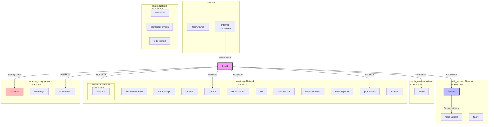
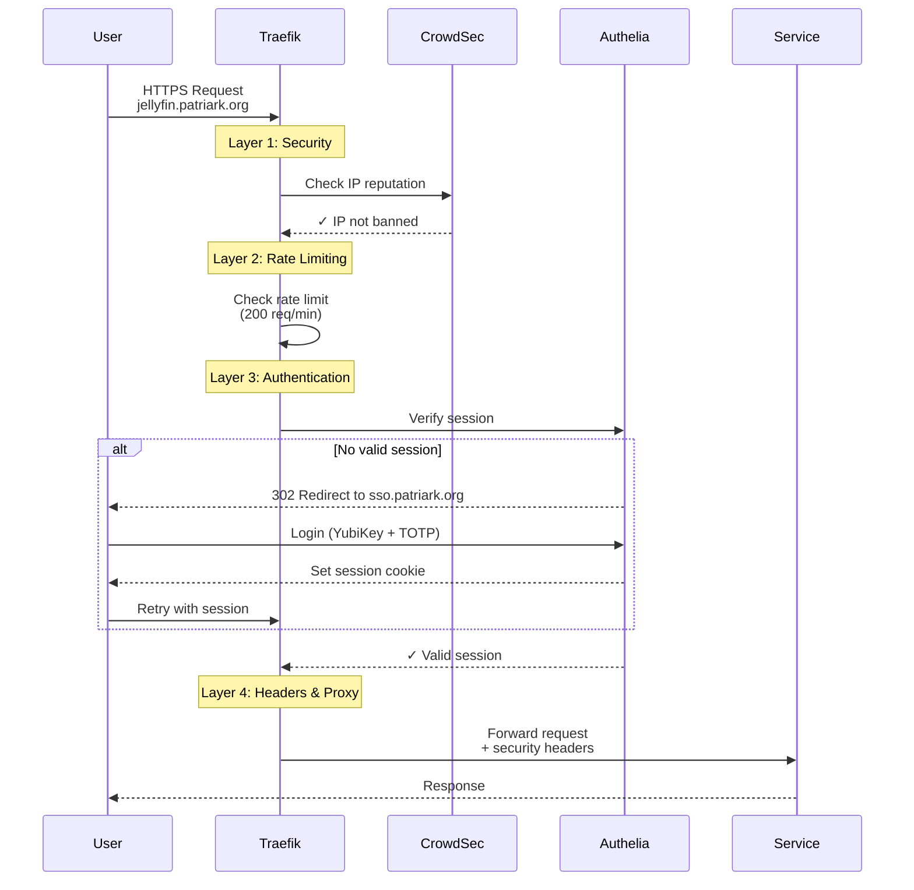

# Network Topology (Auto-Generated)

**Generated:** 2025-12-30 23:03:29 UTC
**System:** fedora-htpc

This document provides visual representations of the homelab network architecture using Mermaid diagrams.

---

## Network Overview

Shows all Podman networks and their member services.



---

## Request Flow

Shows the path of an authenticated request through the system.



---

## Network Details


### auth_services

- **Full Name:** `systemd-auth_services`
- **Subnet:** 10.89.3.0/24
- **Services:** 3

**Members:**
- authelia
- redis-authelia
- traefik


### media_services

- **Full Name:** `systemd-media_services`
- **Subnet:** 10.89.1.0/24
- **Services:** 1

**Members:**
- jellyfin


### monitoring

- **Full Name:** `systemd-monitoring`
- **Subnet:** 10.89.4.0/24
- **Services:** 14

**Members:**
- alert-discord-relay
- alertmanager
- cadvisor
- grafana
- immich-server
- jellyfin
- loki
- nextcloud
- nextcloud-db
- nextcloud-redis
- node_exporter
- prometheus
- promtail
- traefik


### nextcloud

- **Full Name:** `systemd-nextcloud`
- **Subnet:** 10.89.10.0/24
- **Services:** 4

**Members:**
- collabora
- nextcloud
- nextcloud-db
- nextcloud-redis


### photos

- **Full Name:** `systemd-photos`
- **Subnet:** 10.89.5.0/24
- **Services:** 4

**Members:**
- immich-ml
- immich-server
- postgresql-immich
- redis-immich


### reverse_proxy

- **Full Name:** `systemd-reverse_proxy`
- **Subnet:** 10.89.2.0/24
- **Services:** 13

**Members:**
- alertmanager
- authelia
- collabora
- crowdsec
- grafana
- homepage
- immich-server
- jellyfin
- loki
- nextcloud
- prometheus
- traefik
- vaultwarden


---

## Architecture Principles

### Network Segmentation

Services are organized into isolated networks based on function and trust level:

1. **reverse_proxy** - Gateway network
   - Contains Traefik and all internet-accessible services
   - First network in quadlets (gets default route for internet access)

2. **auth_services** - Authentication network
   - Authelia SSO and Redis session storage
   - Isolated from direct internet access

3. **monitoring** - Observability network
   - Prometheus, Grafana, Loki, exporters
   - Scrapes metrics from all services

4. **media_services** - Media processing
   - Jellyfin and related media services

5. **photos** - Photo management
   - Immich and its supporting services (PostgreSQL, Redis, ML)

### Network Ordering

**Critical:** First network in quadlet `Network=` lines gets the default route.

```ini
# Correct - can reach internet
Network=systemd-reverse_proxy.network
Network=systemd-monitoring.network

# Wrong - cannot reach internet
Network=systemd-monitoring.network
Network=systemd-reverse_proxy.network
```

### Service Discovery

Services on the same network can communicate using container names as hostnames (Podman DNS):
- `http://authelia:9091` - Traefik can reach Authelia
- `http://redis-authelia:6379` - Authelia can reach Redis

---

## Quick Links

- [Service Catalog](AUTO-SERVICE-CATALOG.md) - What's running
- [Dependency Graph](AUTO-DEPENDENCY-GRAPH.md) - Service relationships (when generated)
- [Homelab Architecture](20-operations/guides/homelab-architecture.md) - Full documentation

---

*Auto-generated by `scripts/generate-network-topology.sh`*
*GitHub renders Mermaid diagrams automatically*
