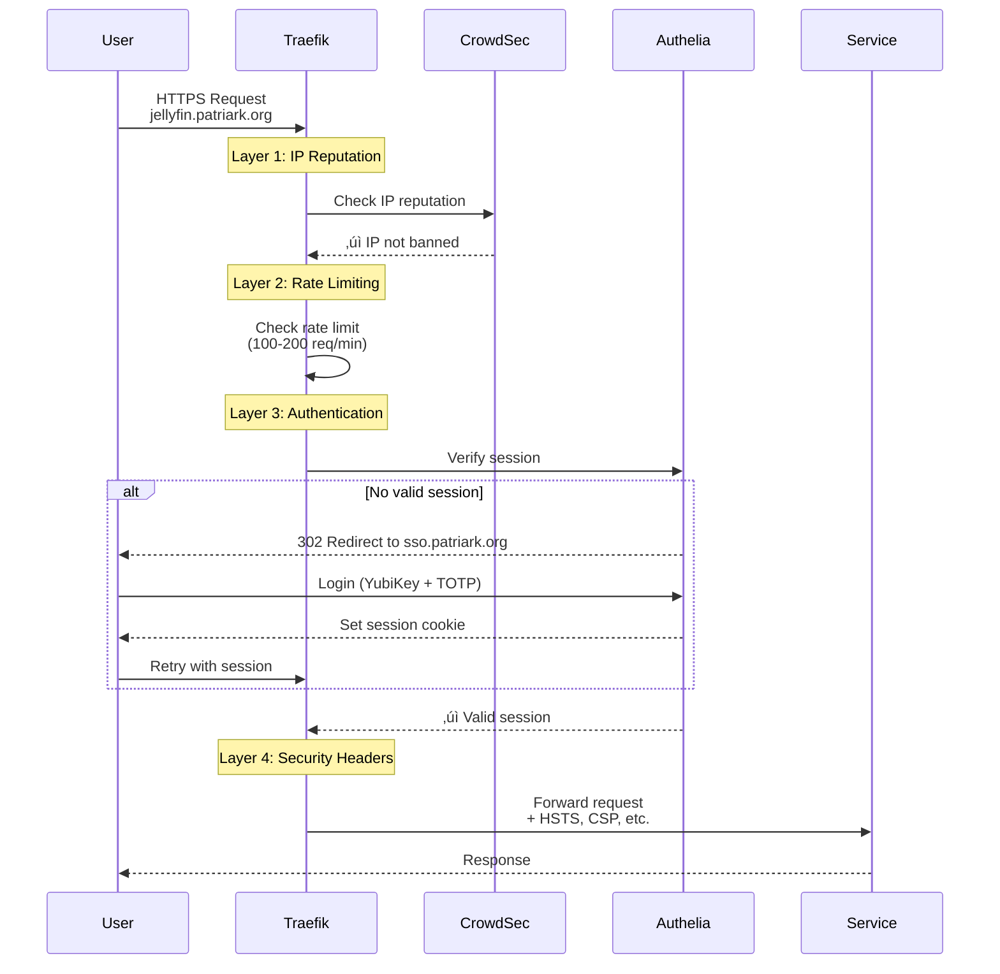

# Network Topology (Auto-Generated)

**Generated:** 2026-02-22 06:02:01 UTC
**System:** fedora-htpc | **Networks:** 8 | **Containers:** 27

---

## 1. Traffic Flow & Middleware Routing

Shows how requests flow from Internet through Traefik with middleware routing based on actual configuration in `config/traefik/dynamic/routers.yml`.

**Key Insights:**
- **CrowdSec** checks ALL traffic (fail-fast: reject banned IPs immediately)
- **Authelia** protects administrative/monitoring services (SSO with YubiKey)
- **Native auth** services handle their own authentication (bypass Authelia)

---

## 2. Network Topology

Shows actual Podman network membership. Services appear in EVERY network they belong to (accuracy over brevity).

---

## Network Membership Matrix

Shows which services belong to which networks. Dynamically generated from running container state.

| Service | auth_services | gathio | home_automation | media_services | monitoring | nextcloud | photos | reverse_proxy |
|---------|:---:|:---:|:---:|:---:|:---:|:---:|:---:|:---:|
| **Gateway & Security** |
| authelia | ✅ | - | - | - | - | - | - | ✅ |
| crowdsec | - | - | - | - | - | - | - | ✅ |
| redis-authelia | ✅ | - | - | - | - | - | - | - |
| traefik | ✅ | - | - | - | ✅ | - | - | ✅ |
| **Public Services** |
| gathio | - | ✅ | - | - | ✅ | - | - | ✅ |
| home-assistant | - | - | ✅ | - | ✅ | - | - | ✅ |
| homepage | - | - | - | - | - | - | - | ✅ |
| immich-server | - | - | - | - | ✅ | - | ✅ | ✅ |
| jellyfin | - | - | - | ✅ | ✅ | - | - | ✅ |
| nextcloud | - | - | - | - | ✅ | ✅ | - | ✅ |
| vaultwarden | - | - | - | - | - | - | - | ✅ |
| **Monitoring** |
| alert-discord-relay | - | - | - | - | ✅ | - | - | - |
| alertmanager | - | - | - | - | ✅ | - | - | ✅ |
| cadvisor | - | - | - | - | ✅ | - | - | - |
| grafana | - | - | - | - | ✅ | - | - | ✅ |
| loki | - | - | - | - | ✅ | - | - | ✅ |
| node_exporter | - | - | - | - | ✅ | - | - | - |
| prometheus | - | - | - | - | ✅ | - | - | ✅ |
| promtail | - | - | - | - | ✅ | - | - | - |
| unpoller | - | - | - | - | ✅ | - | - | - |
| **Backend Services** |
| gathio-db | - | ✅ | - | - | - | - | - | - |
| immich-ml | - | - | - | - | - | - | ✅ | - |
| matter-server | - | - | ✅ | - | - | - | - | - |
| nextcloud-db | - | - | - | - | ✅ | ✅ | - | - |
| nextcloud-redis | - | - | - | - | ✅ | ✅ | - | - |
| postgresql-immich | - | - | - | - | - | - | ✅ | - |
| redis-immich | - | - | - | - | - | - | ✅ | - |

---

## Request Flow

Shows the path of an authenticated request through the middleware layers.

**Middleware Ordering (fail-fast principle):**
1. **CrowdSec** - Fastest (cache lookup) - reject banned IPs immediately
2. **Rate Limiting** - Fast (counter check) - prevent DoS
3. **Authelia** - Expensive (session validation + SSO) - only for legitimate traffic
4. **Security Headers** - Applied on response

---

## Network Details

### auth_services

- **Full Name:** `systemd-auth_services`
- **Subnet:** 10.89.3.0/24
- **Services:** 3

**Members:**
- authelia
- redis-authelia
- traefik

### gathio

- **Full Name:** `systemd-gathio`
- **Subnet:** 10.89.0.0/24
- **Services:** 2

**Members:**
- gathio
- gathio-db

### home_automation

- **Full Name:** `systemd-home_automation`
- **Subnet:** 10.89.6.0/24
- **Services:** 2

**Members:**
- home-assistant
- matter-server

### media_services

- **Full Name:** `systemd-media_services`
- **Subnet:** 10.89.1.0/24
- **Services:** 1

**Members:**
- jellyfin

### monitoring

- **Full Name:** `systemd-monitoring`
- **Subnet:** 10.89.4.0/24
- **Services:** 17

**Members:**
- alert-discord-relay
- alertmanager
- cadvisor
- gathio
- grafana
- home-assistant
- immich-server
- jellyfin
- loki
- nextcloud
- nextcloud-db
- nextcloud-redis
- node_exporter
- prometheus
- promtail
- traefik
- unpoller

### nextcloud

- **Full Name:** `systemd-nextcloud`
- **Subnet:** 10.89.10.0/24
- **Services:** 3

**Members:**
- nextcloud
- nextcloud-db
- nextcloud-redis

### photos

- **Full Name:** `systemd-photos`
- **Subnet:** 10.89.5.0/24
- **Services:** 4

**Members:**
- immich-ml
- immich-server
- postgresql-immich
- redis-immich

### reverse_proxy

- **Full Name:** `systemd-reverse_proxy`
- **Subnet:** 10.89.2.0/24
- **Services:** 14

**Members:**
- alertmanager
- authelia
- crowdsec
- gathio
- grafana
- home-assistant
- homepage
- immich-server
- jellyfin
- loki
- nextcloud
- prometheus
- traefik
- vaultwarden

---

## Related Documentation

For architecture principles, network ordering rules, and troubleshooting:

- [CLAUDE.md](../CLAUDE.md) - Network ordering, gotchas, and deployment patterns
- [Homelab Architecture](20-operations/guides/homelab-architecture.md) - Full architecture overview
- [ADR-018: Static IP Multi-Network Services](00-foundation/decisions/2026-02-04-ADR-018-static-ip-multi-network-services.md) - Static IPs and Traefik /etc/hosts override
- [Service Catalog](AUTO-SERVICE-CATALOG.md) - Complete service inventory
- [Dependency Graph](AUTO-DEPENDENCY-GRAPH.md) - Service dependencies

---

*Auto-generated by `scripts/generate-network-topology.sh`*
*GitHub renders Mermaid diagrams automatically - view this file on GitHub for best experience*
