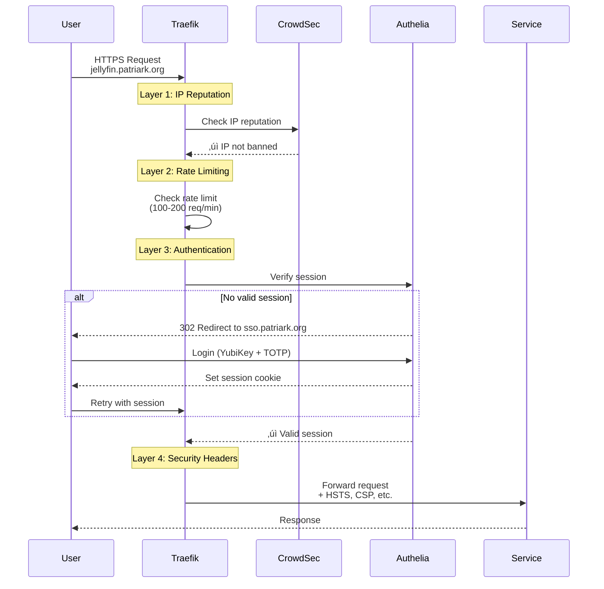

# Network Topology (Auto-Generated)

**Generated:** 2026-01-01 11:08:03 UTC
**System:** fedora-htpc

This document provides visual representations of the homelab network architecture.

---

## Hierarchical Network Architecture

Shows the layered architecture from Internet to services. Each service appears **once** in its primary functional layer.


**Legend:**
- 🔵 **Blue** = Gateway (Traefik)
- 🔴 **Red** = Security (CrowdSec)
- 🟢 **Green** = Authentication (Authelia)
- ⚪ **Light Blue** = Public Services
- 🟡 **Cream** = Monitoring Services
- ⚫ **Gray** = Internal Services
- 🗄️ **Databases** = Cylinder shape
- **Solid arrows** = Primary traffic flow
- **Dotted arrows** = Backend/scraping connections

---

## Network Membership Matrix

Shows which services belong to which networks. Many services are members of multiple networks.

| Service | reverse_proxy | monitoring | auth_services | photos | nextcloud | media_services |
|---------|:-------------:|:----------:|:-------------:|:------:|:---------:|:--------------:|
| **Gateway & Security** |
| traefik | ✅ | ✅ | ✅ | - | - | - |
| crowdsec | ✅ | - | - | - | - | - |
| authelia | ✅ | - | ✅ | - | - | - |
| redis-authelia | - | - | ✅ | - | - | - |
| **Public Services** |
| jellyfin | ✅ | ✅ | - | - | - | ✅ |
| immich-server | ✅ | ✅ | - | ✅ | - | - |
| nextcloud | ✅ | ✅ | - | - | ✅ | - |
| vaultwarden | ✅ | - | - | - | - | - |
| collabora | ✅ | - | - | - | ✅ | - |
| homepage | ✅ | - | - | - | - | - |
| **Monitoring** |
| prometheus | ✅ | ✅ | - | - | - | - |
| grafana | ✅ | ✅ | - | - | - | - |
| loki | ✅ | ✅ | - | - | - | - |
| alertmanager | ✅ | ✅ | - | - | - | - |
| node_exporter | - | ✅ | - | - | - | - |
| cadvisor | - | ✅ | - | - | - | - |
| promtail | - | ✅ | - | - | - | - |
| alert-discord-relay | - | ✅ | - | - | - | - |
| **Backend Services** |
| postgresql-immich | - | - | - | ✅ | - | - |
| redis-immich | - | - | - | ✅ | - | - |
| immich-ml | - | - | - | ✅ | - | - |
| nextcloud-db | - | ✅ | - | - | ✅ | - |
| nextcloud-redis | - | ✅ | - | - | ✅ | - |

**Key Insights:**
- **Traefik** is in 3 networks (gateway, monitoring, auth) to route traffic and be monitored
- **Internet-facing services** are all in `reverse_proxy` (primary) + their functional network
- **Monitoring network** has the most members (14 services) - observability across all tiers
- **Backend databases/caches** are isolated to their functional networks only

---

## Request Flow

Shows the path of an authenticated request through the middleware layers.



**Middleware Ordering (fail-fast principle):**
1. **CrowdSec** - Fastest (cache lookup) - reject banned IPs immediately
2. **Rate Limiting** - Fast (counter check) - prevent DoS
3. **Authelia** - Expensive (session validation + SSO) - only for legitimate traffic
4. **Security Headers** - Applied on response

---

## Network Details


### auth_services

- **Full Name:** `systemd-auth_services`
- **Subnet:** 10.89.3.0/24
- **Services:** 3

**Members:**
- authelia
- redis-authelia
- traefik


### media_services

- **Full Name:** `systemd-media_services`
- **Subnet:** 10.89.1.0/24
- **Services:** 1

**Members:**
- jellyfin


### monitoring

- **Full Name:** `systemd-monitoring`
- **Subnet:** 10.89.4.0/24
- **Services:** 14

**Members:**
- alert-discord-relay
- alertmanager
- cadvisor
- grafana
- immich-server
- jellyfin
- loki
- nextcloud
- nextcloud-db
- nextcloud-redis
- node_exporter
- prometheus
- promtail
- traefik


### nextcloud

- **Full Name:** `systemd-nextcloud`
- **Subnet:** 10.89.10.0/24
- **Services:** 4

**Members:**
- collabora
- nextcloud
- nextcloud-db
- nextcloud-redis


### photos

- **Full Name:** `systemd-photos`
- **Subnet:** 10.89.5.0/24
- **Services:** 4

**Members:**
- immich-ml
- immich-server
- postgresql-immich
- redis-immich


### reverse_proxy

- **Full Name:** `systemd-reverse_proxy`
- **Subnet:** 10.89.2.0/24
- **Services:** 13

**Members:**
- alertmanager
- authelia
- collabora
- crowdsec
- grafana
- homepage
- immich-server
- jellyfin
- loki
- nextcloud
- prometheus
- traefik
- vaultwarden


---

## Architecture Principles

### Network Segmentation Strategy

Services are organized into isolated networks based on function and trust level:

1. **reverse_proxy** (10.89.2.0/24) - **Gateway Network**
   - Contains Traefik and all internet-accessible services
   - **Critical:** First network in quadlets (gets default route for internet access)
   - 13 members including all public-facing services

2. **monitoring** (10.89.4.0/24) - **Observability Network**
   - Prometheus, Grafana, Loki, exporters, and relay services
   - Scrapes metrics from services across all other networks
   - 14 members (most connected network)

3. **auth_services** (10.89.3.0/24) - **Authentication Network**
   - Authelia SSO, Redis session storage, and Traefik
   - Isolated from direct internet except through reverse proxy
   - 3 members (tightly controlled)

4. **photos** (10.89.5.0/24) - **Photo Management Network**
   - Immich application stack with PostgreSQL, Redis, and ML
   - Backend services isolated from internet
   - 4 members

5. **nextcloud** (10.89.10.0/24) - **File Sync Network**
   - Nextcloud application with PostgreSQL, Redis, and Collabora
   - Backend databases accessible only within this network
   - 4 members

6. **media_services** (10.89.1.0/24) - **Media Processing Network**
   - Jellyfin and media-related services
   - 1 member (Jellyfin also in reverse_proxy and monitoring)

### Multi-Network Services

**Why multiple networks?**
- **reverse_proxy** = Internet accessibility
- **monitoring** = Metrics scraping
- **Functional network** = Backend communication (databases, caches)

**Examples:**
- **Traefik (3 networks):** reverse_proxy (gateway), auth_services (Authelia access), monitoring (metrics)
- **Jellyfin (3 networks):** reverse_proxy (internet), monitoring (metrics), media_services (function)
- **Immich (3 networks):** reverse_proxy (internet), monitoring (metrics), photos (backend DB/cache)
- **Nextcloud (3 networks):** reverse_proxy (internet), monitoring (metrics), nextcloud (backend DB/cache)

### Network Ordering in Quadlets

**Critical:** First `Network=` line in quadlet gets the default route (internet access).

```ini
# ✅ Correct - can reach internet AND internal services
Network=systemd-reverse_proxy.network
Network=systemd-monitoring.network
Network=systemd-photos.network

# ❌ Wrong - cannot reach internet (monitoring is internal-only)
Network=systemd-monitoring.network
Network=systemd-reverse_proxy.network
```

**Rule of thumb:**
- Internet-facing services: `reverse_proxy` first
- Internal services: Functional network first (photos, nextcloud, etc.)
- Monitoring-only: `monitoring` network only (no internet needed)

### Service Discovery (Podman DNS)

Services on the same network can communicate using container names as hostnames:
- `http://authelia:9091` - Traefik reaches Authelia (both in auth_services)
- `http://redis-authelia:6379` - Authelia reaches Redis (both in auth_services)
- `http://postgresql-immich:5432` - Immich reaches database (both in photos)
- `http://prometheus:9090` - Grafana reaches Prometheus (both in monitoring)

---

## Quick Links

- [Service Catalog](AUTO-SERVICE-CATALOG.md) - Complete service inventory
- [Dependency Graph](AUTO-DEPENDENCY-GRAPH.md) - Service dependencies
- [Homelab Architecture](20-operations/guides/homelab-architecture.md) - Full documentation

---

*Auto-generated by `scripts/generate-network-topology.sh`*
*GitHub renders Mermaid diagrams automatically - view this file on GitHub for best experience*
